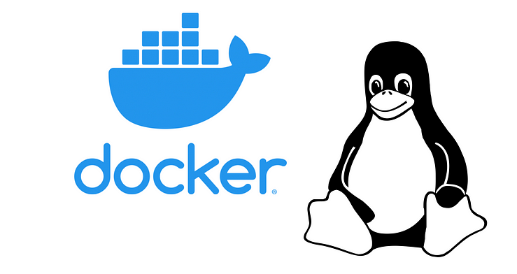
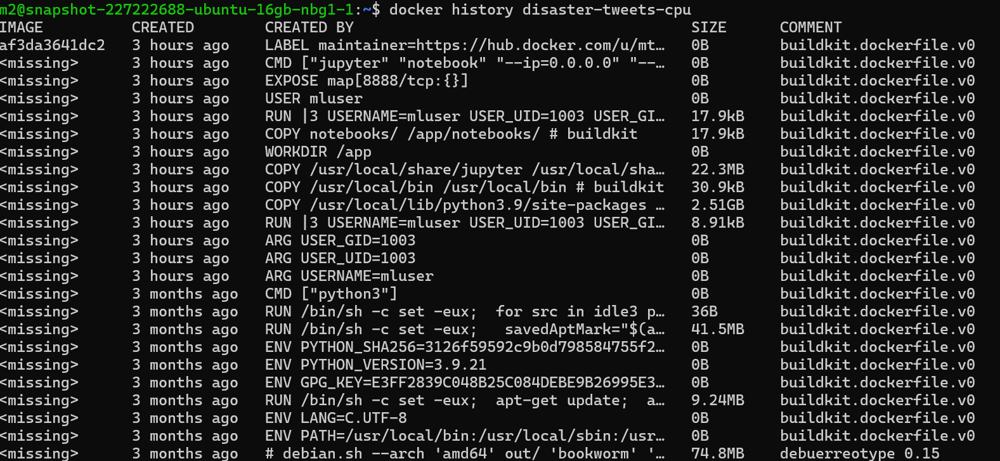
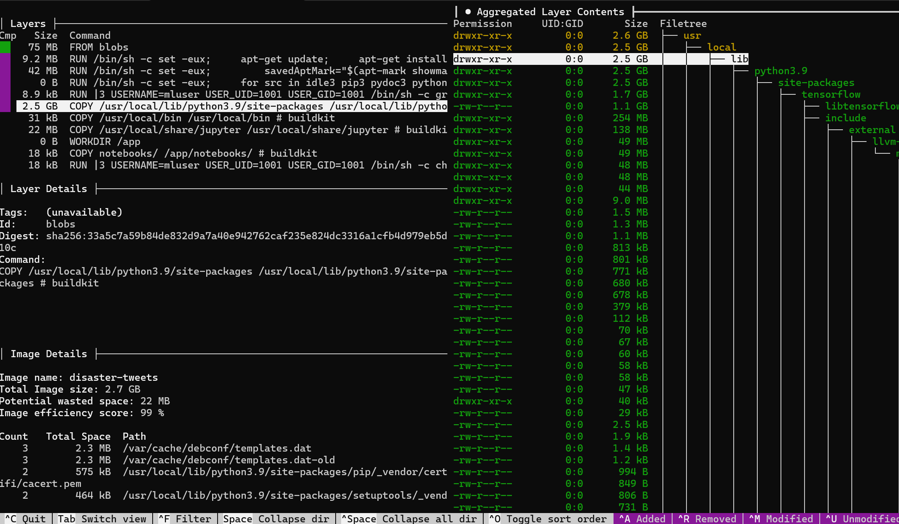

#   Containerized MLE Environment with Docker, TensorFlow, and Jupyter

<p align="center">
  
</p>

## 1. Overview

This project provides a Dockerized development environment for experimenting with an existing dataset and a pretrained model(**TinyBERT**). It uses **Python 3.9**, **TensorFlow**,**KerasNLP**,**KerasCore**, and **Jupyter notebooks**, ensuring collaborators can reproduce experiments without cumbersome local installations.

---

**Main tasks: What should be done**

- **Take any pretrained model or custom framework** and write a Dockerfile that installs it on top of a base Linux image.
- **Choose a dataset or problem with existing solutions** (e.g., a completed Kaggle competition or a tutorial). Ideally, it should include different types of data (text, images, tabular), but that’s not strictly required.
- **Set up a development environment** that allows others to work with the chosen dataset or problem.
- **Follow best practices** in Docker usage.
- **Provide a sufficient development environment** for effective iteration (version control, environment variables, environment management).
- **Main task***: Ensure correct permissions on mounted data.

---

## 2. Criteria

- Follow Docker best practices ([Docker Build Documentation](https://docs.docker.com/build/building/best-practices/)).
- Provide a development environment sufficient for effective iterations (version control, environment variables, environment management).
- Correctly handle file permissions when mounting data volumes.

---

## 3. Dataset Choice

I chose the following Kaggle dataset and tutorial notebook:

> [Keras NLP Starter Notebook - Disaster Tweets](https://www.kaggle.com/code/alexia/kerasnlp-starter-notebook-disaster-tweets) (originally uses DistilBERT, but adapted here for TinyBERT.)

In this competition, the challenge is to build a machine learning model that predicts which tweets are about real disasters and which are not. A dataset of 10,000 tweets, hand-classified, is available. Since this project focuses on the MLE environment rather than the data science side, we don’t delve deeply into that part.

Our plan is to containerize this project so others can work seamlessly without environment-related issues.

---

## 4. Why Containerize?

- **Consistency**: Eliminate “works on my machine” headaches by using a uniform environment. Ship the same environment to anyone, anywhere.
- **Security**: Isolate the container from the host system.
- **Architectural Consistency**: Whether you’re on ARM or x86, Docker’s multi-arch images maintain a standardized environment.
- **Portable Deployment**: From local development machines to remote servers (VPS, VDS, or cloud providers like AWS), containers run predictably anywhere.
- **Reproducibility**: Machine learning projects often rely on specific versions of libraries like TensorFlow, scikit-learn, or Keras. Docker’s layered images capture your environment at build time, ensuring anyone who runs the image has the exact same setup.

---

## 6. Project Structure

```
module-2-containerization/
  ├── Dockerfile
  ├── requirements.txt
  ├── README.md (this guide)
  ├── data/                 # normally gitignored, but included here with a small test dataset for this guide. It’s a local data directory.
  ├── notebooks/            # Keras NLP starter notebook
  ├── .dockerignore         # Keep your Docker build context small and efficient, excluding unnecessary files from build
  ├── .gitignore            # Exclude large files, secret credentials, cache files, checkpoints, etc
  └── docker-compose.yml    # YAML configuration file for Docker Management
```

---

## 7. Requirements & Prerequisites

- **Operating System**: Linux (Ubuntu recommended).
- **Docker**: Must be installed and configured to run without `sudo` (e.g., `sudo usermod -aG docker $USER`).
- **Docker Compose**: If you want to orchestrate multiple services.
- **Version Control**: GitHub/git for cloning and CI/CD processes.

First, clone the repository:

```bash
git clone https://github.com/mtech00/MLE-24-25.git
cd MLE-24-25/module-2-containerization
```

We create a blueprint for our Docker images in the form of a **Dockerfile**, which helps build the base system image from which you can deploy any number of containers.


Before diving into explanations, if you just want to run the project, follow these steps:

### 1. Build the Docker image:

```bash
docker build \
  --build-arg USER_UID=$(id -u) \
  --build-arg USER_GID=$(id -g) \
  -t disaster-tweets .

```

### 2. Run the container:

```bash
docker run --rm -it \
  -p 127.0.0.1:8888:8888 \
  -v $(pwd)/data:/app/data \
  disaster-tweets

```

Now, you can access the application via [http://127.0.0.1:8888](http://127.0.0.1:8888/)


---

## 8. Choosing the Base Image

Many Docker containers start with lightweight Linux distributions to minimize overhead. However, even base Linux images can still contain unnecessary packages and become oversized. Docker’s main advantage is the ability to build precisely what you need, layer by layer. While you could start with a minimal Linux base like Alpine and install Python yourself, that approach can become cumbersome—especially if you rely on large libraries like TensorFlow. if we dont need especially even smaller base image  for extremely resource-limited environments (e.g., IoT devices), that goes beyond our current scope.

For this project, we’ll use a **Python-based** image optimized for Python applications. Since we’re working on a data science–oriented project with Python notebooks, choosing a Python image is both practical and efficient.

We did not use latest one ,Because we want stability and broad compatibility with existing libraries, we’re staying on **Python 3.9** instead of the newest 3.13. This approach avoids library compatibility issues. We also select the **slim** variant to keep the image even smaller ,without uncessary development tools for this project  (`gcc`, `make`, `g++ etc.`).

Why?

- **Lightweight**: `python:3.9-slim` is a relatively small official Python image.
- **Compatibility**: Python 3.9 is supported by popular data science libraries.
- **Ease of Use**: Debian- or Ubuntu-based images simplify installing large libraries like TensorFlow.

Since we want the **exact** same base (not 3.9.1 or 3.9.5 ,any other variant ) each time, we pin it with a SHA256 digest:

```
# ======= STAGE 1: Builder =======
ARG IMAGE=python:3.9-slim@sha256:e52ca5f579cc58...
FROM ${IMAGE} AS builder
```

This ensures we always pull the same layer, avoiding unexpected changes or vulnerabilities if the `python:3.9-slim` tag updates. You can see potential vulnerabilities and image details on [Docker Hub:3.9-slim/images/sha256-f5ad67bdf5***](https://hub.docker.com/layers/library/python/3.9-slim/images/sha256-f5ad67bdf5028207c434bd608afe1b6605c2a2f991e62f562eaa55a092732a55) before selecting a pinned version.

---

## 9. Multi-Stage Docker Builds

We’ll create the first stage of our build—known as a multi-stage build. Because Docker constructs images layer by layer, unnecessary components from earlier layers can extend the final image. Multi-stage builds allow you to copy only what you need from one stage to the next, resulting in a cleaner, more minimal final image.

For example, if you install Git and other build tools in a “builder” stage but don’t need them at runtime, you can just copy the compiled artifacts to the final stage, leaving behind unneeded dependencies.

### Example Steps

1. **Builder Stage**: Install libraries, upgrade pip, and compile or download resources. In our project, we did not install any packages via apt-get, but if we had, cleaning up afterwards would be a good practice for a cleaner build.

   ```bash
   # RUN apt-get update && \
   #       apt-get clean && \
   #       rm -rf /var/lib/apt/lists/*
   ```

2. **Final Stage**: Start from the same base image (or a minimal image what you need , same image will be recommended ) and copy only what’s necessary.


## 10. Installing Dependencies

A pinned `requirements.txt` ensures reproducibility.

Another key point is freezing versions and libraries. Because we’re not using an environment manager like Conda, we must specify exact versions in `requirements.txt` for consistent builds. Sometimes they may not be the latest versions with security fixes, but if we need to update them, we can test first, then re-pin.

We use the full TensorFlow version here. Although this is a CPU-based environment, `tensorflow-cpu` can save space. However, we rely on experimental libraries (e.g., `keras-nlp`) strictly tied to the full TensorFlow, so we keep the full version. Where possible, using CPU-only variants helps reduce image size.

**requirements.txt**:

```
tensorflow==2.18.0
keras-core==0.1.7
keras-nlp==0.19.3
numpy==2.0.2
pandas==2.2.2
matplotlib==3.8.4
scikit-learn==1.6.1
jupyter==1.1.1
```

**In the Dockerfile**:

```
RUN --mount=type=cache,target=/root/.cache/pip \
    pip install --upgrade pip==25.0.1 && \
    pip install --no-cache-dir -r requirements.txt
```

- Since project development is iterative, downloading large libraries repeatedly is inefficient. The **`--mount=type=cache,target=/root/.cache/pip`** feature helps Docker cache packages
- **`--no-cache-dir`**: Removes unnecessary caches.
- Combining commands reduces image layers.

Once we install all necessary tools in the builder stage, we move on to our final stage. We reuse the same slim Python base image for consistency:

```
# ======= STAGE 2: Final runtime =======
FROM ${IMAGE} AS runtime
```

---

## 11. Creating a Non-Root User & Handling Permissions

When running Docker containers, having a non-root user can be critical. Here are the main reasons:

1. **Security**: Root has unrestricted access, posing a risk if someone compromises the container.
2. **System Integrity**: Root could unintentionally modify essential system files.
3. **Permissions with Host**: When mounting host directories, matching user IDs avoids `Permission denied` errors.

If your container mounts a host folder where the user and group IDs differ from root, you’ll run into permission issues. To fix this, you can create a user with the same UID and GID as your local user, passed via Docker build arguments.

Default values (e.g., 1111) help detect improper setups, since widely used IDs like 1000 may hide permission issues.


```
ARG USERNAME=mluser
ARG USER_UID=1111
ARG USER_GID=1111

RUN groupadd --gid ${USER_GID} ${USERNAME} \
    && useradd --uid ${USER_UID} --gid ${USER_GID} -m ${USERNAME}
```

We then copy only what’s needed from the builder layer:

```
COPY --from=builder /usr/local/lib/python3.9/site-packages /usr/local/lib/python3.9/site-packages
COPY --from=builder /usr/local/bin /usr/local/bin
COPY --from=builder /usr/local/share/jupyter /usr/local/share/jupyter
```

Set the working directory:

```
WORKDIR /app
```

Add notebooks:  We’re baking the main notebooks into the image for convenience (instead of relying on users to mount them). This can vary per project, in this case we also need to ensure proper permissions for the working directory so the non-root user can access and modify files:

```
COPY notebooks/ /app/notebooks/
RUN chown -R ${USERNAME}:${USERNAME} /app
```

Expose port 8888 and run Jupyter: This is a run-time command, not a build-time one. The script runs whenever the container starts—no auto-start setup or browser credentials are created; it simply starts the server.

```
EXPOSE 8888
CMD ["jupyter", "notebook", "--ip=0.0.0.0", "--no-browser", "--NotebookApp.token=", "--NotebookApp.password="]
```

Labels:

```
LABEL maintainer="https://hub.docker.com/u/mtech001" \
      version="1.0" \
      description="MLE environment with TensorFlow and Jupyter"
```

---

## 12. Building the Image

### Docker CLI Build

```
docker build \
    --build-arg USER_UID=$(id -u) \
    --build-arg USER_GID=$(id -g) \
    -t disaster-tweets .
```

- `-t disaster-tweets` tags the image.
- `--build-arg USER_UID=$(id -u)` ,`--build-arg USER_GID=$(id -g)` aligns container user ID and group ID with your local user.

Optional flags:

- `--no-cache`: Forces a clean build.
- `--progress=plain`: Displays full build logs.

x86 is not the de-facto standard anymore. Many servers and laptops (like Apple Silicon) use ARM architecture. Some old libraries or images support only x86, but today that’s rarely a problem, especially when using Docker Desktop, which handles architecture automatically.


## 13. Creating a Container

After building the image:

```
docker run --rm -it \
    -p 127.0.0.1:8888:8888 \
    -v $(pwd)/data:/app/data \
    disaster-tweets
```

- `--rm`: Removes the container after it stops.

- `-it`: Interactive mode to view logs , foreground running rather than background.

- `-p 127.0.0.1:8888:8888`: Binds Jupyter to localhost (not public).

  - `127.0.0.1` ensures the port is **only exposed to localhost** (your machine).
  - Without this, Docker defaults to `0.0.0.0`, exposing the port on **all interfaces**, including public ones.

  ### ⚠️ **Security Risk**  
  > If you're running this on a VPS, `-p 8888:8888` will expose your Jupyter Notebook to the internet, e.g. [http://12.34.56.78:8888](http://12.34.56.78:8888), unless firewalled.

  ### Use loopback address to restrict access:

  ```bash
  -p 127.0.0.1:8888:8888
  ```
  Only accessible locally, **not** from the outside world.

  ### ⚠️ Hidden Risk:

  Even with `127.0.0.1`, Docker's network model may allow **other containers or hosts on the same Layer 2 (L2) segment** to access it, depending on the setup.

  See:
  - [Docker security doc - published-ports](https://docs.docker.com/engine/network/#published-ports)
  - [Moby issue #45610](https://github.com/moby/moby/issues/45610)

  ### Secure Example:

  ```bash
  docker run -p 127.0.0.1:8080:80 -p '[::1]:8080:80' nginx
  ```

  `-v $(pwd)/data:/app/data`: Mounts your local `data` folder into the container.

  After covering Docker networking, let’s talk about **data persistence**. Each user should be able to work on their own data — and still access it **even after the container is deleted**.

  There are a few common methods:

  ---

  ### 1. **Docker Volumes**

  Managed by the Docker engine.

  - Easy to share between containers
  - Abstracted from host path
  - Example: `docker volume create mydata`

  ---

  ### 2. **Host Data Binding (Bind Mounts)**

  Bind a **host directory** to a **container path**.

  - Direct access to host files
  - Simpler than volumes
  - Needs proper **permission handling**
  - Example used in this project:

    ```bash
    -v /host/data:/app/data
    ```

  > We solved permission issues by matching container UID/GID to the host.

  ---

  ### 3. **Object Storage / Cloud Mounts**

  Mount cloud storage (e.g., S3, GDrive) inside containers.

  - Useful in multi-user or distributed setups
  - Changes can sync to the cloud

  ---

  Each method has trade-offs. In this project, we used **host data binding** for simplicity, with manual UID/GID handling to solve permission issues.


---

## 14. Docker Compose

Docker Compose simplifies multi-container setups. Here’s a basic For advanced projects, Docker Compose can simplify multi-container setups or integrate additional services 

`Docker Compose can be used in simpler projects, but in more advanced ones, we must tackle complexity. We might use Kubernetes or other management tools, which often require YAML configurations. Docker Compose helps us with multi-container environments, simplified configurations, and more. Here's an example : [docs.docker.com - compose-application-model](https://docs.docker.com/compose/intro/compose-application-model/#illustrative-example)


`docker-compose.yml `:

```yaml
version: '3.8'
services:
  app:
    build:
      context: .
      args:
        USER_UID: ${USER_UID}
        USER_GID: ${USER_GID}
    image: disaster-tweets
    ports:
      - "127.0.0.1:8888:8888"
    volumes:
      - ./data:/app/data
    stdin_open: true
    tty: true
```

Run:

```
USER_UID=$(id -u) USER_GID=$(id -g) docker-compose up --build
```

  after running the container, you'll see Jupyter startup logs showing the access URL.

By default, Jupyter runs on 127.0.0.1:8888.


If you're running this on a remote VPS, exposing Jupyter publicly is risky.

Instead, use SSH port forwarding to access it securely from your local machine:


```
ssh -L 8888:localhost:8888 user@your_server_ip
```
 What this does:

Forwards the VPS’s local port 8888 to your laptop’s local port 8888


Now, on your laptop, you can open:

[http://127.0.0.1:8888](http://127.0.0.1:8888)

and securely access Jupyter running on the VPS


No need to expose the Jupyter port to the public — SSH handles the secure tunnel.


---

## 15. Docker Layers & Analysis

Now we are switching to additional parts. We mentioned that clear Docker layers are important, but how can we assess what’s going on inside those layers? There are some tools and built-in Docker options for this.

A simple built-in option is:

```
docker history
```



For more advanced, layer-by-layer analysis, you can use a tool called `dive`. It helps identify which libraries take up the most space (e.g., TensorFlow):

```
dive --source docker disaster-tweets
```




---

## 16. Version Control & .gitignore

Use Git or another VCS to track your Dockerfile and related files. Example `.gitignore`:

```
# Python
__pycache__/
*.pyc

# Jupyter
.ipynb_checkpoints/

# Env & logs
.env
.venv/
env/
venv/
*.env
*.log

# OS-specific
.DS_Store
Thumbs.db

# Data & models
data/
*.h5
*.pt
*.ckpt
*.csv

# Build artifacts
*.whl

# Editor
.vscode/
```

This excludes Python caches, Jupyter checkpoints, local data, environment files, and OS artifacts.

---

## 17. Testing on Different Environments

- Works on ARM-based  and x86 (Intel/AMD) servers (e.g., Hetzner).
- Adjusting different`USER_UID` and `USER_GID` ensures correct permissions on mounted data.
- Also tested on local Linux VMs with different user IDs and group IDs.

---

## 18. Environment Variables vs. Build Arguments


In this project, we didn't need credentials or version decisions.


ENV comes from environment variables


ARG is only for build-time arguments


If they have the same name, ENV overrides ARG


But which one is proper for embedding API secrets etc?


None of them.


ARG embeds secrets into the image → insecure


ENV is accessible — visible via docker inspect or inside the container


✅ Better approach: use -e in docker run


```
docker run -e API_KEY=your_real_key your_image
```

This sets the env variable only at runtime

It’s not stored in the image

So, it's a more secure way to pass secrets


---

## 19. Conclusion & Next Steps

With this Docker-based setup:

1. We have a minimal, reproducible environment for the Kaggle “Disaster Tweets” project.
2. File permissions are handled by matching user and group IDs to avoid errors on mounted data.

**Potential next steps**:

- Extend the environment with GPU support.
- Integrate CI/CD pipelines (e.g., GitHub Actions) to build and push images.
- Add validation tests for data preprocessing or training scripts.

Containerization significantly reduces environment configuration overhead, enabling collaborators to focus on data science and model experimentation.

---

## 20. References

- [Docker Documentation](https://docs.docker.com/)
- [Docker Build Best Practices](https://docs.docker.com/build/building-best-practices/)
- [Kaggle - Disaster Tweets Dataset](https://www.kaggle.com/competitions/nlp-getting-started)
- https://docs.docker.com/engine/network/
- https://github.com/moby/moby/issues/45610
-  [Docker security doc - published-ports](https://docs.docker.com/engine/network/#published-ports)
- [docs.docker.com - compose-application-model](https://docs.docker.com/compose/intro/compose-application-model/#illustrative-example)
